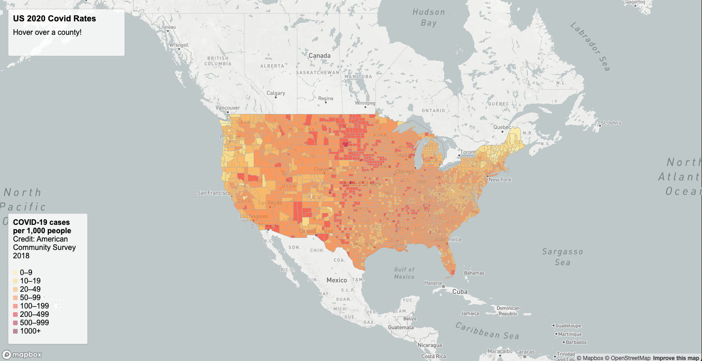
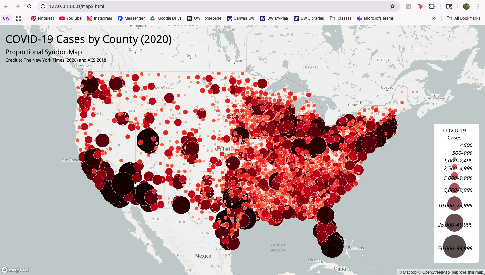

# U.S. COVID-19 2020 Thematic Maps  

### Project Overview

This project visualizes Covid-19 data for US counties in 2020 through two interactive thematic maps:  
* Choropleth map of Covid-19 case rates  
* Proportional symbols map of total Covid-19 cases

The goal of this lab was to practice creating web-based maps, and to effectivily communicate the message of the raw data. The Covid-19 data comes from The New York Times, and the population data used for calculating the case rates comes from the 5 year estimates of the 2018 American Community Survey. The U.S. county boundaries are also from from the U.S. Census Bureau. I pre-processed the data to calculate the case rates per 1,000 residents and exported the files to GeoJSON.

### Map Descriptions  

**Map 1 – Choropleth Map of Covid-19 *Rates***

Map 1 displays the number of Covid-19 cases per 1,000 residents by county. It is centered over the US and includes interactive elements like clickable counties for displaying case rate details. I've also included a legend, map title and credits.  
Map URL: [Map 1: Choropleth Map](https://github.com/hollystew/hollystew-covidmaps/blob/main/map1.html)

**Map 2 – Proportional Symbols Map of Covid-19 *Cases***

Map 2 displays the total COVID-19 cases by county using proportional symbols. It's zoomed and centered over the US with county labels and the number of cases visible with the hover feature. It includes a legend, map title, subtitle and credits.

Map URL: [Map 2: Proportional Symbols](https://github.com/hollystew/hollystew-covidmaps/blob/main/map2.html)
  

### Primary Functions and Features  

I converted the Covid-19 rates and counts shapefiles to GeoJSON through QGIS. I implemented interactive map elements, such as popups for county distinction and Covid-19 case information by using the step by step instructions in Labs 3 and 4. I styled the maps as choropleth for case rates and proportional symbols for case counts as noted in the rubric.    

### Data Sources  

* COVID-19 case and death counts (2020): The New York Times
* County population (2018): American Community Survey 5-year estimates
* U.S. county boundaries: U.S. Census Bureau

### Credits and Acknowledgments  

Data processing and lab guidance were provided by course materials and the TA. 
No AI tools were used in this assignment.
